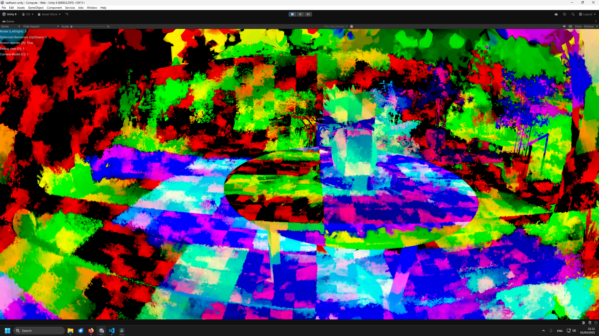

# Radiant Foam Viewer: Real-Time Differentiable Ray Tracing

https://www.youtube.com/watch?v=CDza_K9XNSQ

Visualization of point indices with Morton reordering enabled.

## Features

- compute shader based renderer
  - morton reordering of voronoi cells
- (very) limited WebGL renderer
- optimized `.ply` loader (`binary_little_endian`)

## Model Data

Pre-trained models from the original authors:

- https://github.com/theialab/radfoam/releases/tag/v1
- https://drive.google.com/drive/folders/1Gs2cMeurL3l0jy497xoGqiFmlR9r7W8w

## Original Project Page

[Radiant Foam: Real-Time Differentiable Ray Tracing](https://radfoam.github.io/)

## Known Issues

- colors still seem washed out compared to the original paper
- not sure if performance is up to par with the original CUDA implementation, as I could not get it running locally yet (getting around 25-50fps on my RTX 3070, depending on view point)

¯\\\_(ツ)\_/¯
